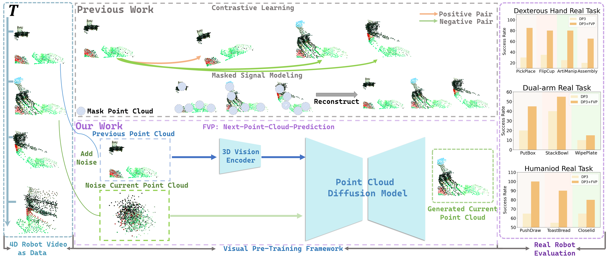

# FVP: 4D Visual Pre-training for Robot Learning
[[Website](https://4d-visual-pretraining.github.io/)] [arXiv (https://arxiv.org/abs/2508.17230)] [ICCV 2025] 
<p align="center">
  
</p>

FVP is a novel 3D point cloud  representation learning pipeline for robotic manipulation. Different from prior works in Contrastive Learning and Masked Signal Modeling,  FVP trains 3D visual representations by leveraging the preceding frame point cloud and employing a diffusion model to predict the point cloud of the current frame.

This is a  PyTorch implementation of the paper [FVP: 4D Visual Pre-training for Robot Learning](https://arxiv.org/abs/2311.17901):

```bibtex
@article{cheng2025fvp,
    author    = {Chengkai Hou and Yanjie Ze and Yankai Fu and Zeyu Gao and Yue Yu and Songbo Hu and Shanghang Zhang and Huazhe Xu},
    title     = {FVP: 4D Visual Pre-training for Robot Learning},
    journal   = {ICCV},
    year      = {2025},
  }
```

:exclamation: This repo  contains configs and experiments on simulation dataset and real-world dataset.

## Requirements
### 3D Diffusion policy
[Please see DP3 installation instructions.](https://github.com/YanjieZe/3D-Diffusion-Policy/blob/master/INSTALL.md)

### FVP
In addition to PyTorch environments, please install:
```sh
conda install pyyaml
pip install ema-pytorch tensorboard
```

## Simulation Dataset Generation
You can generate a dataset of simulated data following the DP3 instructions, for example:
```sh
cd your_path/3D-Diffusion-Policy-master
bash scripts/gen_demonstration_adroit.sh hammer
```
## Real-world Dataset Generation
We collect the real-world dataset as a dictionary，  which follows the same format as the simulator dataset：
1. "point_cloud": Array of shape (T, Np, 6), Np is the number of point clouds, 6 denotes [x, y, z, r, g, b]. **Note: it is highly suggested to crop out the table/background and only leave the useful point clouds in your observation, which demonstrates effectiveness in our real-world experiments.**
2. "image": Array of shape (T, H, W, 3)
3. "depth": Array of shape (T, H, W)
4. "agent_pos": Array of shape (T, Nd), Nd is the action dim of the robot agent, i.e. 22 for our dexhand tasks (6d position of end effector + 16d joint position)
5. "action": Array of shape (T, Nd). We use *relative end-effector position control* for the robot arm and *relative joint-angle position control* for the dex hand.

You can follow [this example](https://github.com/YanjieZe/3D-Diffusion-Policy/blob/master/scripts/convert_real_robot_data.py) to collect real-world dataset.
     


## FVP Pre-training 
For config `dp3.yaml`, you should change your dataset path. Then, you can use FVP to train:
```sh
python train_gpu.py  --config config/dp3.yaml 
```


### DP3  Post-training
Simply load the weights trained using FVP, and then proceed with the standard DP3 command line for execution.
```sh
bash scripts/train_policy.sh dp3 adroit_hammer 0112 0 0
```
